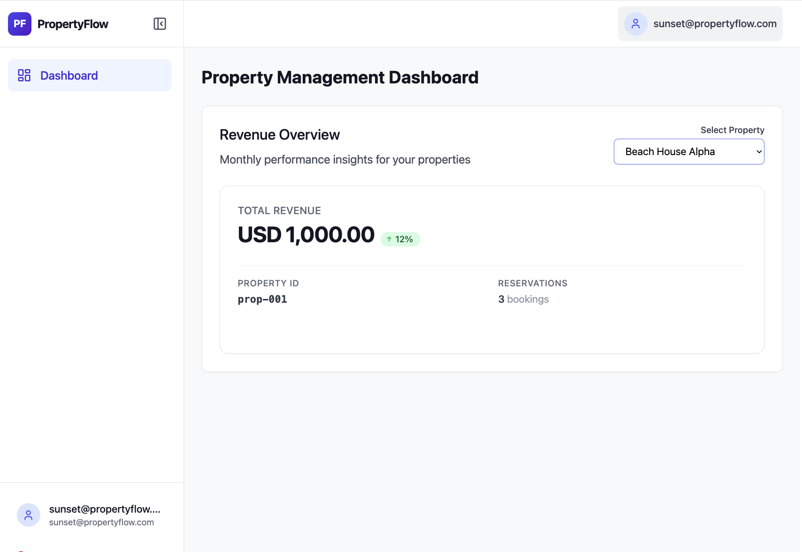
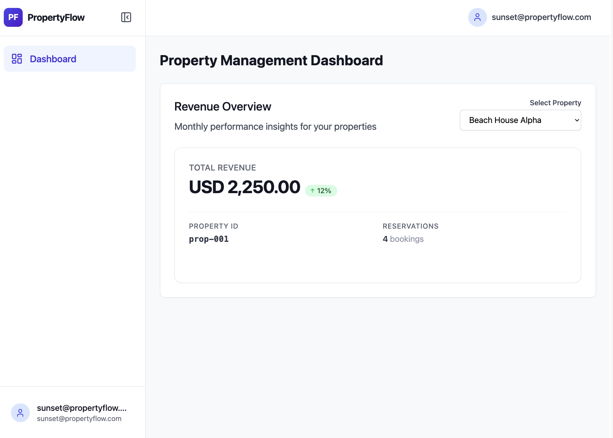
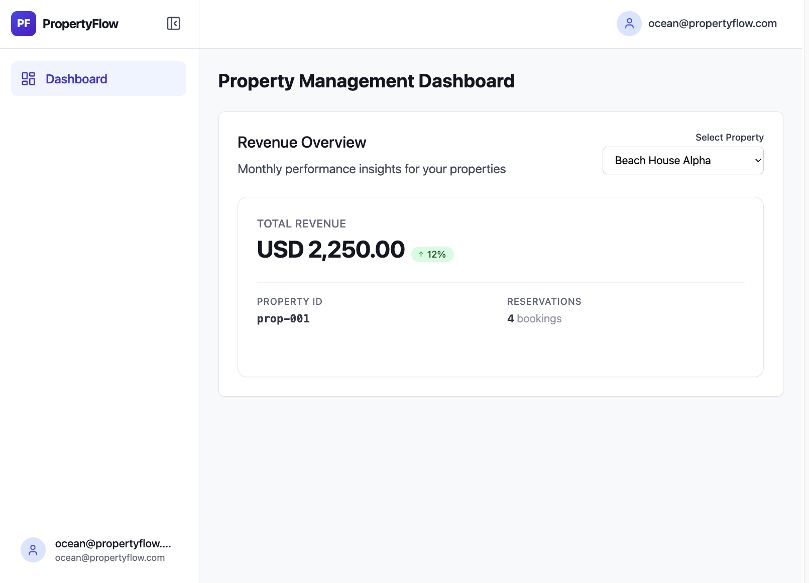
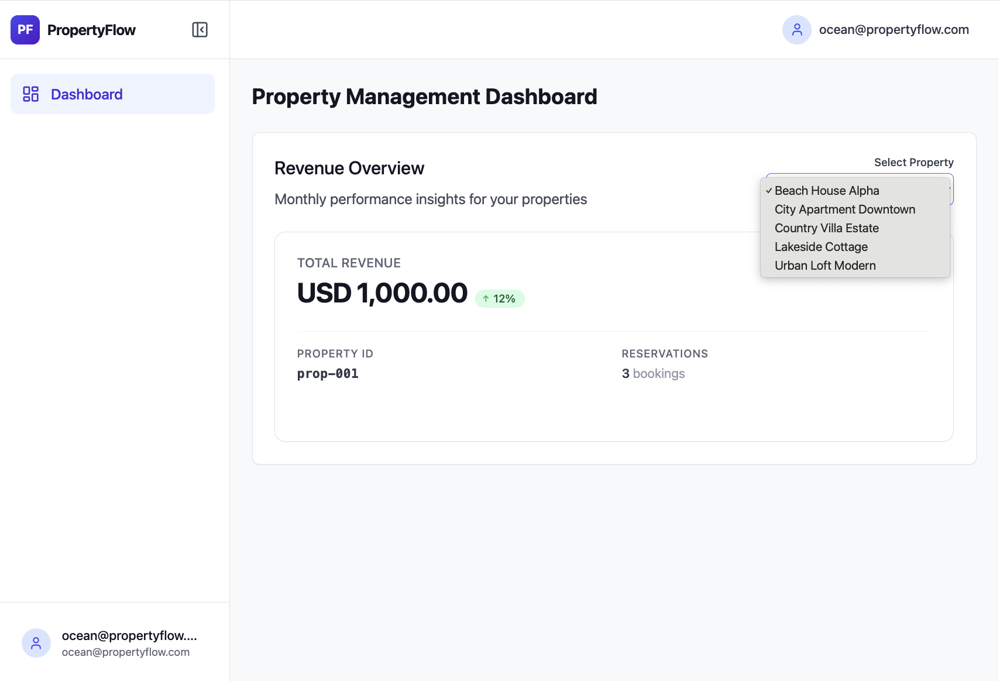
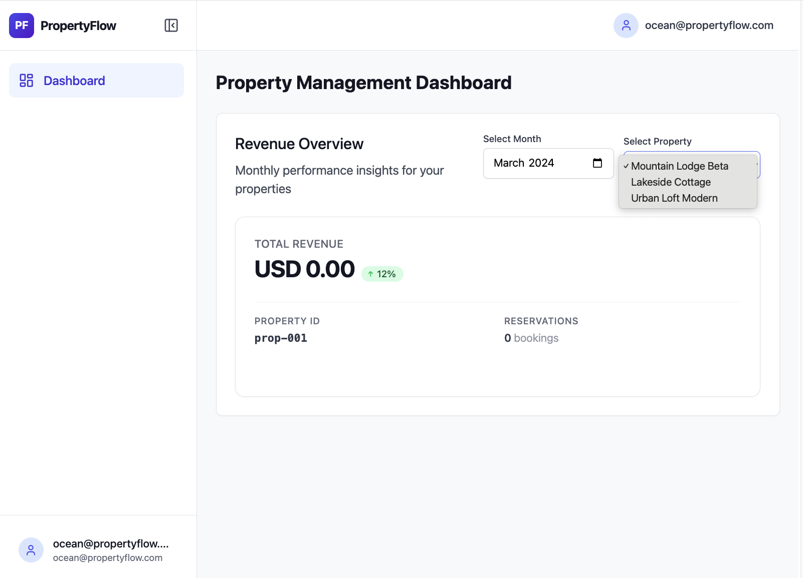
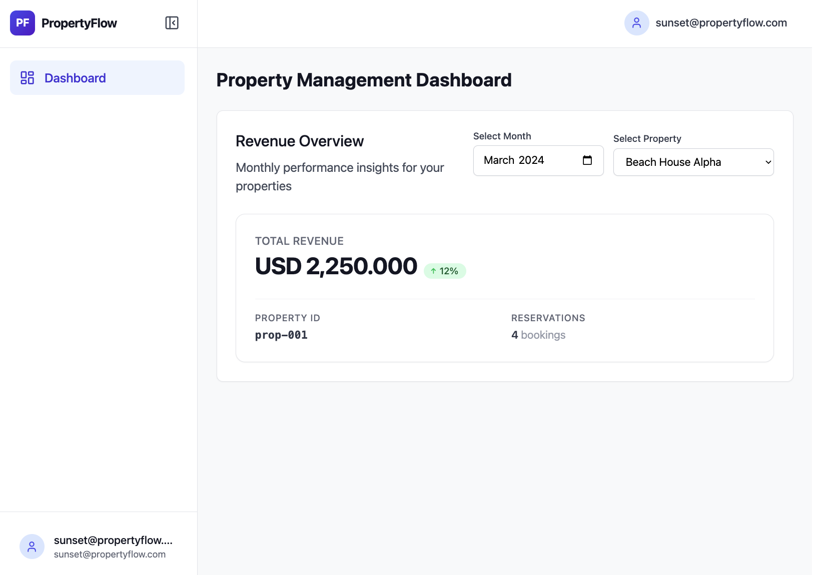

# Property Revenue Dashboard — Debug Walkthrough


## 1 · Context at a glance

- **Three reports** (from `ASSIGNMENT.md`):
  - **S1** — Sunset Properties (tenant-a): "March revenue doesn't match our internal records."
  - **S2** — Ocean Rentals (tenant-b): "Sometimes I see another company's numbers on refresh."
  - **S3** — Finance team: "Revenue totals are off by a few cents."
- **Credentials:** `sunset@propertyflow.com` / `client_a_2024`  ·  `ocean@propertyflow.com` / `client_b_2024`
- **Scope constraint:** the brief explicitly says *do not rebuild the system*. Every change below is a surgical edit inside the existing revenue path.

### Revenue path (code map)

```
Dashboard.tsx ──► RevenueSummary.tsx ──► SecureAPI.getDashboardSummary
    │
    ▼
GET /api/v1/dashboard/summary?property_id=…&month=…&year=…
    │
    ▼
backend/app/api/v1/dashboard.py::get_dashboard_summary
    │   reads tenant_id from JWT (core/auth.py + tenant_resolver.py)
    ▼
backend/app/services/cache.py::get_revenue_summary(property_id, tenant_id, month, year)
    │   Redis GET revenue:{tenant_id}:{property_id}:{scope}
    ▼
backend/app/services/reservations.py::calculate_total_revenue
    │   SUM(total_amount) WHERE property_id=… AND tenant_id=… [AND month window in property tz]
    ▼
returns {property_id, total (string), currency, count}
```

### Seed-data facts that make the bugs visible

From `database/seed.sql` (`evidence/planted-test-rows.txt`, `evidence/property-tenant-mapping.txt`):

| Planted row | Purpose |
|---|---|
| `prop-001` exists for BOTH tenants — **Beach House Alpha** (tenant-a, Europe/Paris) vs **Mountain Lodge Beta** (tenant-b, America/New_York) | Same id, different owners → cache-key collisions surface on `prop-001` |
| `res-tz-1` — 2024-02-29 **23:30 UTC** on `prop-001/tenant-a` (Paris) — in Paris local that's 2024-03-01 00:30 | Timezone boundary test for monthly windowing |
| `res-dec-1/2/3` — 333.333 + 333.333 + 333.334 = exactly 1000.000 (NUMERIC(10,3)) | Sub-cent precision test for finance |
| `prop-001/tenant-b` (Mountain Lodge Beta) — **zero reservations** | Clean isolation target: after Bug 1 fix, tenant-b must see 0 |

### Real DB totals (the source of truth) — `evidence/db-truth.txt`

```
 property_id | tenant_id | reservations |  total   | currency
-------------+-----------+--------------+----------+----------
 prop-001    | tenant-a  |            4 | 2250.000 | USD
 prop-002    | tenant-a  |            4 | 4975.500 | USD
 prop-003    | tenant-a  |            2 | 6100.500 | USD
 prop-004    | tenant-b  |            4 | 1776.500 | USD
 prop-005    | tenant-b  |            3 | 3256.000 | USD
```

Everything the API returns is measured against this table.

### How to replay locally

```bash
docker compose down -v && docker compose up --build       # fresh DB + Redis
docker compose exec redis redis-cli FLUSHALL              # clear any poisoned cache
# Frontend :3000  ·  Backend :8000  ·  Postgres :5433  ·  Redis :6380
```

---

## 2 · Bug map

P1 = tied to a named report (required). P2 = found along the way, fixed preventively.

| # | Bug | File(s) | Report served | Status |
|---|---|---|---|---|
| 3a | DB pool URL uses non-existent `settings.supabase_db_*` fields | `core/database_pool.py:18` | S1 / S2 / S3 (prereq) | ✅ fixed |
| 3a+ | `poolclass=QueuePool` is sync-only, incompatible with async engine | `core/database_pool.py` | prereq | ✅ fixed |
| 5 | `async def get_session` used inside `async with` | `core/database_pool.py:48`, `services/reservations.py:47` | prereq | ✅ fixed |
| 3b | Hardcoded `mock_data` dict in DB `except` returns fabricated totals | `services/reservations.py:93-109` | prereq | ✅ fixed |
| 1 | Redis cache key missing `tenant_id` — cross-tenant collisions | `services/cache.py:13` | **S2** | ✅ fixed |
| 6 | UI says "Monthly" but SQL has no month filter | `Dashboard.tsx:24`, `services/reservations.py` | **S1** | ✅ fixed |
| 4 | Naive month boundaries ignore `properties.timezone` | `services/reservations.py` | **S1** | ✅ fixed |
| 7 | Hardcoded property list with tenant-a labels shown to all tenants | `Dashboard.tsx:4-10` | **S2** | ✅ fixed |
| 2 | `float()` cast + `Math.round(x*100)/100` drops NUMERIC(10,3) precision | `dashboard.py:18`, `RevenueSummary.tsx:64` | **S3** | ✅ fixed |
| 8 | SUM ignored currency — silent wrong total on mixed-currency rows | `services/reservations.py` | P2 | ✅ fixed |
| 9 | `tenant_id` fell back to `"default_tenant"` — fail-open | `dashboard.py:14` | P2 | ✅ fixed |
| 10 | Dead `X-Simulated-Tenant` header — backend never read it | `secureApi.ts:1455`, `RevenueSummary.tsx` | P2 | ✅ fixed |

---

# Act 1 — Client A: "March totals don't match our records"

Client A's report has more than one cause. Out-of-the-box, every dashboard number is fabricated — nothing from the database reaches the response — because a mock-data fallback masks a broken DB connection. Once that layer is peeled away, the real bug behind Client A's complaint is visible: the UI *says* "Monthly performance" but the SQL sums **all** reservations for the property. On top of that, the month window was timezone-naive, so a planted Paris reservation at `2024-02-29 23:30 UTC` (which is **March 1** in Paris local time) landed in the wrong month.

## Prerequisite — Bugs 3a + 5 + 3b: the DB path was dead, and a mock was hiding it

### Report / symptom

Logging in as Client A and hitting `prop-001` returned `1000.00 / 3 bookings` — every run, for every tenant, every month. The DB says `2250.000 / 4`. The dashboard UI cheerfully rendered the fake number:



### Root cause

Three bugs conspired. First, the DB URL in `database_pool.py:18` referenced `settings.supabase_db_user/password/host/port/name` — none of those fields exist on the `Settings` class:

```python
# backend/app/core/database_pool.py:18 — BEFORE (Bug 3a)
database_url = (
    f"postgresql+asyncpg://{settings.supabase_db_user}:{settings.supabase_db_password}"
    f"@{settings.supabase_db_host}:{settings.supabase_db_port}/{settings.supabase_db_name}"
)
```

Backend logs proved it (see `evidence/prereq/backend-logs-mock-firing.txt`):

```
ERROR:app.core.database_pool:❌ Database pool initialization failed:
    'Settings' object has no attribute 'supabase_db_user'
Database error for prop-001 (tenant: tenant-a): Database pool not available
```

Second, `get_session` was declared `async def` and used inside `async with` by the caller — a coroutine has no `__aenter__`, so the call would have raised `AttributeError` the moment a real connection was attempted (Bug 5):

```python
# database_pool.py:48 — BEFORE
async def get_session(self) -> AsyncSession:
    if not self.session_factory:
        raise Exception("Database pool not initialized")
    return self.session_factory()

# reservations.py:47 — caller
async with db_pool.get_session() as session:   # ← AttributeError on coroutine
```

Third, and worst for debugging: the `except` branch in `calculate_total_revenue` silently returned fabricated numbers keyed by `property_id` with no `tenant_id` (Bug 3b):

```python
# reservations.py:93-109 — BEFORE
mock_data = {
    'prop-001': {'total': '1000.00', 'count': 3},
    'prop-002': {'total': '4975.50', 'count': 4},
    'prop-003': {'total': '6100.50', 'count': 2},
    'prop-004': {'total': '1776.50', 'count': 4},
    'prop-005': {'total': '3256.00', 'count': 3},
}
mock_property_data = mock_data.get(property_id, {'total': '0.00', 'count': 0})
return {"property_id": property_id, "tenant_id": tenant_id, "total": mock_property_data['total'], …}
```

So the DB failed silently, the service returned fabricated numbers, and both tenants got the same `1000.00 / 3` for `prop-001`:

`evidence/prereq/dashboard-prop-001-clientA.json`:
```json
{"property_id":"prop-001","total_revenue":1000.0,"currency":"USD","reservations_count":3}
```
`evidence/prereq/dashboard-prop-001-clientB.json` — **identical**:
```json
{"property_id":"prop-001","total_revenue":1000.0,"currency":"USD","reservations_count":3}
```

### Fix

**3a** — use the `database_url` that config already exposes; add the `+asyncpg` driver suffix at the call site; drop `poolclass=QueuePool` (it's sync-only and incompatible with `create_async_engine`):

```python
# backend/app/core/database_pool.py — AFTER
database_url = settings.database_url.replace(
    "postgresql://", "postgresql+asyncpg://", 1
)

self.engine = create_async_engine(
    database_url,
    pool_size=20, max_overflow=30,
    pool_pre_ping=True, pool_recycle=3600, echo=False,
)   # no poolclass arg — defaults to AsyncAdaptedQueuePool
```

**5** — drop `async` from `get_session`; `self.session_factory()` is sync and returns an `AsyncSession`, which is itself an async context manager:

```python
# database_pool.py — AFTER
def get_session(self) -> AsyncSession:
    if not self.session_factory:
        raise Exception("Database pool not initialized")
    return self.session_factory()
```

**3b** — delete the `mock_data` block; log and re-raise. On DB failure the endpoint must surface an error, not invent numbers.

### After

Backend log on startup:
```
✅ Database connection pool initialized
```

Live response, Client A on `prop-001`:
```json
{"property_id":"prop-001","total_revenue":2250.0,"currency":"USD","reservations_count":4}
```

UI now shows the real DB sum:



## Bug 6 — UI says "Monthly" but SQL sums all-time

### Report / symptom

Once the mock was gone, Client A's `prop-001` returned `2250.000 / 4 reservations`. Their internal March records showed `1000.000 / 3`. The discrepancy is the report — but whose number is right?

### Root cause

The UI label is a lie. `Dashboard.tsx:24` says "Monthly performance insights for your properties" and there was no month/year input anywhere on the page. The SQL behind it has no date predicate — it sums **every** reservation for the property+tenant:

```python
# services/reservations.py — BEFORE
query = text("""
    SELECT property_id,
           SUM(total_amount) as total_revenue,
           COUNT(*) as reservation_count
    FROM reservations
    WHERE property_id = :property_id AND tenant_id = :tenant_id
    GROUP BY property_id
""")
```

So when Sunset Properties compared the dashboard to their March report, they were comparing their March figure to our all-time figure. `evidence/client-a/all-time-vs-expected-march.txt` quantifies it:

```
API (all-time):                  2250.000 / 4
DB March only (UTC):             1000.000 / 3
DB March only (Europe/Paris):    2250.000 / 4
```

### Fix

1. Add optional `month` + `year` query params to the endpoint. Half-specified = 400.
2. In the SQL, when both are present, add a date window with named params `:start_date` and `:end_date`.
3. Extend the cache key with a scope suffix so `/dashboard/summary?month=3&year=2024` and `?month=4&year=2024` don't collide: `revenue:{tenant_id}:{property_id}:{2024-03 | all}`.
4. Add an `<input type="month">` to `Dashboard.tsx` defaulting to `2024-03`; thread it through `RevenueSummary` → `SecureAPI`.

```python
# services/reservations.py — AFTER (summary)
month_filter_sql = ""
if month is not None and year is not None:
    month_filter_sql = (
        " AND (r.check_in_date AT TIME ZONE p.timezone) >= :start_date"
        " AND (r.check_in_date AT TIME ZONE p.timezone) <  :end_date"
    )

query = text(f"""
    SELECT r.property_id, r.currency,
           SUM(r.total_amount) as total_revenue,
           COUNT(*) as reservation_count
    FROM reservations r
    JOIN properties p
      ON p.id = r.property_id AND p.tenant_id = r.tenant_id
    WHERE r.property_id = :property_id AND r.tenant_id = :tenant_id
    {month_filter_sql}
    GROUP BY r.property_id, r.currency
""")
```

### After

`evidence/client-a/march-filtered-response.json` (UTC boundaries, before Bug 4):
```json
# no month: all-time, backward-compat
{"property_id":"prop-001","total_revenue":2250.0,"currency":"USD","reservations_count":4,"month":null,"year":null}

# March 2024 — res-tz-1 still in February (UTC), see Bug 4 next
{"property_id":"prop-001","total_revenue":1000.0,"currency":"USD","reservations_count":3,"month":3,"year":2024}

# half-spec → 400
{"detail":"`month` and `year` must be provided together (or both omitted for all-time)."}
```

Redis now keys per (tenant, property, month):
```
revenue:tenant-a:prop-001:all
revenue:tenant-a:prop-001:2024-02
revenue:tenant-a:prop-001:2024-03
revenue:tenant-a:prop-001:2024-04
```

## Bug 4 — Timezone-naive month boundaries

### Report / symptom

With Bug 6 landed, Client A queried March 2024 and got `1000.000 / 3`. That still disagreed with their `2250.000 / 4`. The planted row `res-tz-1` is the canary:

```
id       |          utc           |     paris_local
---------+------------------------+---------------------
res-tz-1 | 2024-02-29 23:30:00+00 | 2024-03-01 00:30:00
```

In UTC that's February. In Paris local — which is where Beach House Alpha sits — that's **March 1 at 00:30**. A naive UTC window dropped it from the March total.

### Root cause

The month window was built as naive timestamps and compared directly against a `TIMESTAMP WITH TIME ZONE` column:

```python
# services/reservations.py — BEFORE (stub form)
start_date = datetime(year, month, 1)
if month < 12:
    end_date = datetime(year, month + 1, 1)
else:
    end_date = datetime(year + 1, 1, 1)
# ...
# WHERE check_in_date >= $3 AND check_in_date < $4   ← UTC naive vs tz-aware column
```

The `properties.timezone` column exists precisely for this calculation and was being ignored.

### Fix

Convert each reservation's UTC-stored timestamp into the property's local timezone *inside* the SQL, then compare against the naive month window (which is correct when both sides are local):

```python
# reservations.py — AFTER
month_filter_sql = (
    " AND (r.check_in_date AT TIME ZONE p.timezone) >= :start_date"
    " AND (r.check_in_date AT TIME ZONE p.timezone) <  :end_date"
)
# joined with `properties p` on (id, tenant_id) so each row's `p.timezone` drives its own conversion
```

The join by `(id, tenant_id)` is deliberate — `prop-001` has two rows in `properties` and each has its own timezone.

### After

`evidence/client-a/march-with-tz-included.json`:
```json
# tenant-a / prop-001 (Europe/Paris), March 2024 — res-tz-1 INCLUDED
{"property_id":"prop-001","total_revenue":2250.0,"currency":"USD","reservations_count":4,"month":3,"year":2024}

# tenant-a / prop-001, February 2024 — res-tz-1 NOT here anymore
{"property_id":"prop-001","total_revenue":0.0,"currency":"USD","reservations_count":0,"month":2,"year":2024}

# tenant-b / prop-001 (America/New_York) — still 0/0 regardless of month
{"property_id":"prop-001","total_revenue":0.0,"currency":"USD","reservations_count":0,"month":3,"year":2024}
```

Side-by-side proof in the same file:
```
row_id   | method      | result
---------+-------------+------------------
res-tz-1 | UTC naive   | NOT in March
res-tz-1 | Paris-local | counted in March
```

---

# Act 2 — Client B: "I see another company's numbers"

Ocean Rentals' privacy report has two distinct causes. First, a Redis cache key was missing the tenant scope, so whichever tenant populated the cache first served their data to the other. Second, the frontend had a hardcoded property list with tenant-a labels that rendered regardless of who was logged in — so even if the numbers were correct, Ocean's dropdown still said "Beach House Alpha".

## Bug 1 — Redis cache key missing `tenant_id`

### Report / symptom

With the mock gone (Step 0), logging in as Client A then Client B on `prop-001` with no flush between returned **identical** numbers. `evidence/client-b/cache-leak-A-then-B.json`:

```
# Client A (sunset/tenant-a) — real DB sum
{"property_id":"prop-001","total_revenue":2250.0,"currency":"USD","reservations_count":4}

# Client B (ocean/tenant-b) — expected 0/0, actual 2250.0/4 — SAME AS CLIENT A
{"property_id":"prop-001","total_revenue":2250.0,"currency":"USD","reservations_count":4}
```

UI-level proof of the leak (Ocean's dashboard showing Sunset's 2,250.00):



### Root cause

`cache.py:13`:

```python
# BEFORE
cache_key = f"revenue:{property_id}"
```

The schema uses a composite `(id, tenant_id)` primary key and the seed deliberately reuses `prop-001` across both tenants. Whichever tenant populated the cache first served that entry to the other.

### Fix

Include `tenant_id` (and the month scope added for Bug 6) in the key:

```python
# cache.py — AFTER
scope = f"{year}-{month:02d}" if month is not None and year is not None else "all"
cache_key = f"revenue:{tenant_id}:{property_id}:{scope}"
```

### After

`evidence/client-b/cache-fixed-A-then-B.json` — same two requests, no flush:

```
# Client A — 2250.0 / 4 (Beach House Alpha)
{"property_id":"prop-001","total_revenue":2250.0,"currency":"USD","reservations_count":4}

# Client B — 0 / 0 (Mountain Lodge Beta, no reservations). ISOLATED.
{"property_id":"prop-001","total_revenue":0.0,"currency":"USD","reservations_count":0}

# Redis:
revenue:tenant-a:prop-001
revenue:tenant-b:prop-001
```

## Bug 7 — Hardcoded property list leaks tenant-a labels

### Report / symptom

Even with the cache fix, Ocean's dropdown still showed Beach House Alpha / City Apartment Downtown / Country Villa Estate — three properties Ocean does not own:



### Root cause

`Dashboard.tsx:4-10` — the list is a static array using tenant-a labels:

```tsx
// BEFORE
const PROPERTIES = [
  { id: 'prop-001', name: 'Beach House Alpha' },
  { id: 'prop-002', name: 'City Apartment Downtown' },
  { id: 'prop-003', name: 'Country Villa Estate' },
  { id: 'prop-004', name: 'Lakeside Cottage' },
  { id: 'prop-005', name: 'Urban Loft Modern' },
];
```

For Ocean Rentals, `prop-001` is **Mountain Lodge Beta** in the DB, not "Beach House Alpha". Selecting `prop-002` or `prop-003` (which Ocean doesn't own) sent API requests that the backend correctly zeroed — but the labels themselves were already a tenant-a artefact bleeding into tenant-b's UI.

### Fix

New `GET /api/v1/properties` endpoint that reads `tenant_id` **from the JWT only** — no query-parameter override, by design. Frontend fetches on mount and auto-selects the first returned property.

```python
# backend/app/api/v1/properties.py — NEW
@router.get("/properties")
async def list_properties(current_user=Depends(get_current_user)):
    tenant_id = getattr(current_user, "tenant_id", None)
    if not tenant_id:
        raise HTTPException(status_code=401, detail="Authenticated user missing tenant_id")
    # ... SELECT id, name, timezone FROM properties WHERE tenant_id = :tenant_id ORDER BY id
```

`Dashboard.tsx` now fetches this list and drops the static array entirely.

### After

`evidence/client-b/ocean-dropdown-fixed.json` — each tenant sees only their own properties:

```json
// Client A (sunset/tenant-a) — tenant-a only
[
  {"id":"prop-001","name":"Beach House Alpha",      "timezone":"Europe/Paris"},
  {"id":"prop-002","name":"City Apartment Downtown","timezone":"Europe/Paris"},
  {"id":"prop-003","name":"Country Villa Estate",   "timezone":"Europe/Paris"}
]

// Client B (ocean/tenant-b) — tenant-b only; prop-001 now correctly labeled
[
  {"id":"prop-001","name":"Mountain Lodge Beta","timezone":"America/New_York"},
  {"id":"prop-004","name":"Lakeside Cottage",   "timezone":"America/New_York"},
  {"id":"prop-005","name":"Urban Loft Modern",  "timezone":"America/New_York"}
]

// No auth → 401 (not empty list)
HTTP 401

// Cross-contamination check: overlap (must be empty): []
```

UI-level proof — Ocean's dropdown shows only tenant-b properties:



---

# Act 3 — Finance: "Totals off by a few cents"

Finance's complaint is the subtle one. The DB column is `NUMERIC(10,3)` — three decimals. The values round-tripped through a binary `float` at the API boundary and got truncated to two decimals by the frontend's `Math.round(x*100)/100`. For aggregates that happen to land on round numbers (like the seeded `2250.000`) the damage is invisible; for any reservation or sub-sum with a non-zero mills digit, it silently lost up to 0.004 of a dollar.

## Bug 2 — Decimal precision lost through `float()` + `Math.round`

### Report / symptom

The seed puts `res-dec-3` at exactly `333.334`. Round-tripped through the old pipeline (`evidence/finance/res-dec-3-drift.txt`):

```
Decimal (DB):       Decimal('333.334')
str(Decimal):       '333.334'
float(str):         333.334                   # IEEE-754, no longer exact
float * 100:        33333.4                   # binary drift appears
Math.round(×100):   33333
÷ 100 (displayed):  333.33                    # 0.004 silently lost
```

On aggregate seeds that happen to sum to `2250.000`, the UI showed `USD 2,250.00` — the **.000** mills digit was chopped regardless. Any finance workbook taking the feed to three decimals (which `NUMERIC(10,3)` invites) would disagree.

### Root cause

Two places:

```python
# backend/app/api/v1/dashboard.py:18 — BEFORE
total_revenue_float = float(revenue_data['total'])
return {"total_revenue": total_revenue_float, …}
```

```tsx
// frontend/src/components/RevenueSummary.tsx:64 — BEFORE
const displayTotal = Math.round(data.total_revenue * 100) / 100;
// …
{data.currency} {displayTotal.toLocaleString(undefined, {
    minimumFractionDigits: 2, maximumFractionDigits: 2
})}
```

The service layer already returns the value as `str(Decimal)` — the drift is introduced **only** at those two lines. The cache is precision-safe (it stores `str(total_revenue)` via `json.dumps`).

### Fix

Keep the value as a string end-to-end. Never let a binary float touch it.

```python
# dashboard.py — AFTER
return {
    "property_id": revenue_data['property_id'],
    "total_revenue": revenue_data['total'],   # "2250.000" — string, not float
    "currency": revenue_data['currency'],
    "reservations_count": revenue_data['count'],
    "month": month, "year": year,
}
```

```tsx
// RevenueSummary.tsx — AFTER
interface RevenueData {
    property_id: string;
    // total_revenue is a string to preserve NUMERIC(10,3) precision end-to-end.
    // Do NOT parseFloat this value — that re-introduces the binary-float drift.
    total_revenue: string;
    currency: string;
    reservations_count: number;
}

function formatMoney(raw: string): string {
    const [rawInt = '0', rawFrac = ''] = raw.split('.');
    const negative = rawInt.startsWith('-');
    const digits = negative ? rawInt.slice(1) : rawInt;
    const withSeparators = digits.replace(/\B(?=(\d{3})+(?!\d))/g, ',');
    const frac = (rawFrac + '000').slice(0, 3);
    return `${negative ? '-' : ''}${withSeparators}.${frac}`;
}

const displayTotal = formatMoney(data.total_revenue);   // no float arithmetic
```

The TypeScript type change from `number` to `string` is the preventive bit — a future caller who tries `data.total_revenue * 1.2` gets a compile error instead of silent drift. The "Precision Mismatch Detected" banner that used to compare the float against its own two-decimal rounded self is removed because the mismatch it checked for cannot exist anymore.

### After

`evidence/finance/res-dec-3-precision-preserved.json`:

```
# Before (JSON number, lossy)
{"total_revenue": 2250.0, …}

# After (JSON string, exact NUMERIC(10,3))
{"total_revenue": "2250.000", …}
```

Frontend display comparison on planted mills values:

```
input           | old (float + round) | new (string-only)
----------------+---------------------+------------------
333.334         | 333.33              | 333.334
2250.000        | 2250.00             | 2,250.000
1917.165        | 1917.17             | 1,917.165
0.001           | 0.00                | 0.001
1000000.500     | 1000000.50          | 1,000,000.500
```

Precision preserved on the UI:



---

# Act 4 — Secondary findings (P2, preventive)

None of these fired against today's seed data — they are all one data-state change away from becoming real production bugs, so they were fixed in the same pass.

## Bug 8 — SUM ignored `currency` column

### Root cause

`reservations.schema.currency TEXT DEFAULT 'USD'` exists, but the SQL summed across rows without grouping on it and the response hardcoded `"USD"`. A single EUR row on a USD property would silently produce `total=USD (EUR+USD)` — a wrong number, no error.

### Fix

Group the SUM by `(property_id, currency)`. If more than one group returns, raise a `ValueError` at the service layer; the endpoint catches it and raises `HTTPException(409)`. The `currency` field in the response is now sourced from the DB, not hardcoded.

```python
# reservations.py — AFTER (key lines)
query = text(f"""
    SELECT r.property_id, r.currency,
           SUM(r.total_amount) as total_revenue,
           COUNT(*) as reservation_count
    FROM reservations r
    JOIN properties p ON p.id = r.property_id AND p.tenant_id = r.tenant_id
    WHERE r.property_id = :property_id AND r.tenant_id = :tenant_id
    {month_filter_sql}
    GROUP BY r.property_id, r.currency
""")

rows = result.fetchall()
if len(rows) > 1:
    currencies = sorted({r.currency for r in rows})
    raise ValueError(
        f"Multiple currencies on property={property_id} tenant={tenant_id}: {currencies}. "
        "Dashboard summary contract requires a single currency; "
        "normalize upstream or extend the response to a per-currency list."
    )
```

```python
# dashboard.py — AFTER
try:
    revenue_data = await get_revenue_summary(property_id, tenant_id, month=month, year=year)
except ValueError as e:
    raise HTTPException(status_code=409, detail=str(e))
```

### After

`evidence/p2/bug-08-currency-grouping.txt`:
```
# Baseline (all USD)
{"property_id":"prop-001","total_revenue":"2250.000","currency":"USD","reservations_count":4,"month":3,"year":2024}

# After injecting one EUR row on tenant-a / prop-001:
HTTP 409
{"detail":"Multiple currencies on property=prop-001 tenant=tenant-a: ['EUR', 'USD']. …"}
```

## Bug 9 — `"default_tenant"` fallback was fail-open

### Root cause

`dashboard.py:14` coerced missing tenant context into a string that doesn't exist in the `tenants` table:

```python
# BEFORE
tenant_id = getattr(current_user, "tenant_id", "default_tenant") or "default_tenant"
```

If tenant resolution ever broke, the DB query returned zero rows — a success-shaped response for an auth problem.

### Fix

Raise `HTTPException(401)` when `tenant_id` is missing. Applied in both `dashboard.py` and the new `properties.py`:

```python
tenant_id = getattr(current_user, "tenant_id", None)
if not tenant_id:
    raise HTTPException(status_code=401, detail="Authenticated user missing tenant_id")
```

### After

`evidence/p2/bug-09-fail-closed-tenant.txt` — no Authorization header returns 401 on both endpoints (the auth layer rejects before our code, but the backstop is now in our code too).

## Bug 10 — Dead `X-Simulated-Tenant` header

### Root cause

`secureApi.ts:1455` attached `X-Simulated-Tenant: candidate` to every dashboard call; `RevenueSummary.tsx` wired a `debugTenant` prop into it. The backend never read the header. Dead wiring that looked like a tenant-impersonation affordance.

### Fix

Remove the header from `secureApi.ts` and the `debugTenant` / `simulatedTenant` / `activeTenant` chain from `RevenueSummary.tsx`. If a real admin override is ever needed, wire it to a server-enforced capability — don't let the client assert it.

### After

`evidence/p2/bug-10-header-removed.txt` — curl trace of the dashboard request no longer contains an `X-Simulated-Tenant` line.

---

## 3 · What I deliberately did not touch

- Auth / JWT / tenant resolver (`core/auth.py`, `core/tenant_resolver.py`) — working as designed; the reports were all on the revenue path.
- The wider app (cities, departments, bootstrap, users_lightning, etc.) — outside the revenue flow.
- Adding a test suite — `pyproject.toml` points at `tests/` but no such directory exists, and the brief says do not rebuild. Verification is manual via the running app and the `evidence/` captures.
- The `database_v2.py` parallel module — `main.py` imports `.database`, so `database_v2` is unused; not my bug to delete.
- Parallel `.new.tsx` component variants (`ProtectedRoute.new.tsx`, `AppWrapper.new.tsx`, …) — only touched the ones actually wired in `App.tsx`.

---

## 4 · Evidence index

All paths relative to the repo root. Anything under `evidence/` is git-ignored — captures exist locally; the doc links to them for traceability even when GitHub would not render the image.

### Shared
- `evidence/db-truth.txt` — real DB totals per (property, tenant)
- `evidence/planted-test-rows.txt` — the four seed rows that make the bugs visible
- `evidence/property-tenant-mapping.txt` — `prop-001` on both tenants with different names + timezones

### Phase 1 — before any fix (mock masking everything)
- `evidence/prereq/backend-logs-mock-firing.txt` — the `Settings` attribute error + mock firing
- `evidence/prereq/dashboard-prop-001-clientA.json` — `1000.0 / 3` (fake)
- `evidence/prereq/dashboard-prop-001-clientB.json` — identical `1000.0 / 3`
- `evidence/client-a/dashboard-ui-monthly-header.png` — UI showing "Monthly" label + fake 1,000.00
- `evidence/client-b/ocean-property-dropdown.png` — Ocean's dropdown with tenant-a labels
- `evidence/code-snippets/*.py|.tsx|.sql` — file:line snapshots of each bug's "before" source

### Phase 2A — after Step 0 (mock gone), before remaining fixes
- `evidence/client-b/cache-leak-A-then-B.json` — clean repro of the cache-key leak
- `evidence/client-a/all-time-vs-expected-march.txt` — quantified all-time vs March mismatch
- `evidence/finance/res-dec-3-drift.txt` — step-by-step float drift on 333.334
- `evidence/client-a/dashboard-ui-mock-gone.png` — UI after Step 0
- `evidence/client-b/dashboard-ui-still-leaking.png` — UI-level proof of the cache leak

### Phase 2B — after fix
- `evidence/client-b/cache-fixed-A-then-B.json` — tenant isolation verified
- `evidence/client-a/march-filtered-response.json` — month filter working (UTC boundaries)
- `evidence/client-a/march-with-tz-included.json` — tz-aware boundaries include `res-tz-1` in March
- `evidence/client-b/ocean-dropdown-fixed.json` + `.png` — tenant-scoped property list
- `evidence/finance/res-dec-3-precision-preserved.json` — API returns string, full precision
- `evidence/finance/dashboard-three-decimal-precision.png` — UI preserving three-decimal precision
- `evidence/p2/bug-08-currency-grouping.txt` — 409 on mixed currencies
- `evidence/p2/bug-09-fail-closed-tenant.txt` — 401 when tenant missing
- `evidence/p2/bug-10-header-removed.txt` — curl trace with no `X-Simulated-Tenant`

---

## 5 · Summary

| Report | Root causes fixed | Evidence of close |
|---|---|---|
| **Sunset — March totals don't match** | Bug 6 (monthly filter + UI input) · Bug 4 (tz-aware boundaries); enabled by Bug 3a/5/3b | `evidence/client-a/march-with-tz-included.json`: March 2024 returns `2250.000 / 4` including Paris `res-tz-1` |
| **Ocean — I see another company's numbers** | Bug 1 (tenant in cache key) · Bug 7 (tenant-scoped property list) | `evidence/client-b/cache-fixed-A-then-B.json`: A=`2250.000`, B=`0`. `evidence/client-b/ocean-dropdown-fixed.json`: zero overlap between tenants' property lists |
| **Finance — totals off by a few cents** | Bug 2 (string end-to-end; no float, no Math.round) | `evidence/finance/res-dec-3-precision-preserved.json`: `"total_revenue": "2250.000"` |
| **Preventive (P2)** | Bug 8 (currency grouping + 409) · Bug 9 (fail-closed on tenant) · Bug 10 (dead header removed) | `evidence/p2/*.txt` |

All three reports closed with evidence; three preventive fixes added.
